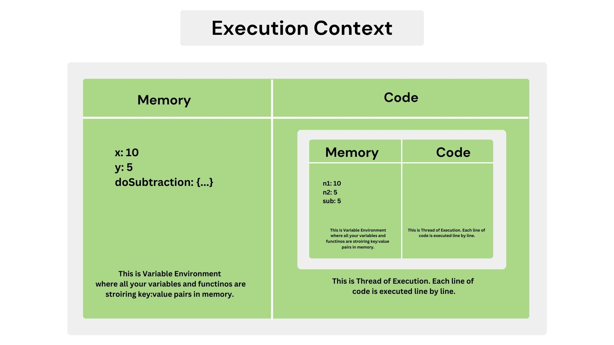
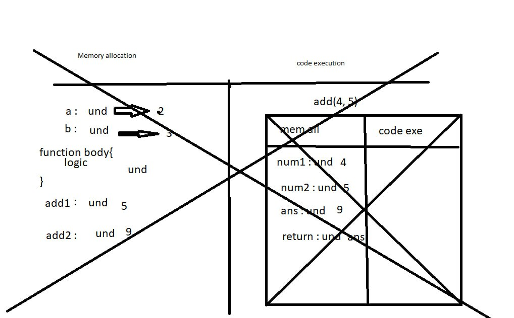

# JavaScript: founder and brief history

**Founder:** Brendan Eich.
**Quick history (beginner-friendly):**

- Created by Brendan Eich at Netscape in 1995.
- Initially called Mocha, then LiveScript, then JavaScript.
- Designed to run in the browser to make web pages interactive (manipulate content, respond to user input).
- Since then it grew into an ecosystem (browsers, transpilers, frameworks, runtime environments like Node.js).

# Inspect browser & run JavaScript (DevTools)

Steps to open Developer Tools (works in Chrome, Edge, Firefox):

1. Right-click on a page and choose **Inspect** (or press `F12` or `Ctrl+Shift+I` / `Cmd+Option+I` on Mac).
2. Click the **Console** tab to run JavaScript interactively.
3. Type JS and press Enter. Example:

```js
console.log("Hello from the console");
```

### Simple calculation in the browser console

Example: evaluate `2 + 3 * 4`. Show arithmetic step-by-step:

- Multiply first: `3 * 4 = 12`
- Then add: `2 + 12 = 14`
  In the console:

```js
2 + 3 * 4; // => 14
```

# Simple JavaScript examples

### 1) Arithmetic example (script)

Create `calc.js`:

```js
// calc.js
const a = 2;
const b = 3;
const c = 4;
const result = a + b * c; // multiplication before addition
console.log(result); // prints 14
```

Run in browser by including it in an HTML file (see below) or run with Node.js (`node calc.js`).

### 2) Inspect + run inline in console

```js
// type this directly in the browser console
console.log("2 + 3 * 4 =", 2 + 3 * 4);
```

# DOM manipulation: example using Google’s search box

> Note: this is an example for learning. Manipulating other sites in your own browser via DevTools is fine for learning. Don’t automate or submit forms on sites you don’t control unless you have permission.

Open Google in your browser, open DevTools → Console, and try:

```js
// find the Google search input (name="q" is commonly used on google.com)
const input = document.querySelector('input[name="q"]');
input.value = "JavaScript tutorial"; // set the search text

// Trigger events so site reacts (some sites rely on events)
input.dispatchEvent(new Event("input", { bubbles: true }));

// Option 1: submit the enclosing form (may or may not work depending on site's JS)
const form = input.closest("form");
if (form) form.submit();

// Option 2: simulate pressing Enter
const enterEvent = new KeyboardEvent("keydown", {
  key: "Enter",
  code: "Enter",
  bubbles: true,
});
input.dispatchEvent(enterEvent);
```

Explanation:

- `querySelector` finds the input element.
- Setting `value` puts text in the field.
- Submitting the form or firing keyboard events simulates a user action.

# Node.js: founder and what it is

**Founder:** Ryan Dahl.
**What Node.js is (simple):**

- A JavaScript runtime built on Chrome’s V8 engine that lets you run JavaScript **outside** the browser (on servers, tools, CLI scripts).
- Useful for building servers, command-line scripts, build tools, etc.

# Install Node.js (beginner steps)

1. Go to the official Node.js website and download the installer for your OS. (Choose the **LTS** version for stability.)
2. **Windows / macOS:** run the downloaded installer and follow prompts.
3. **Linux (Ubuntu/Debian) example using package manager:**

   - Basic quick install (may not give latest LTS):

     ```bash
     sudo apt update
     sudo apt install nodejs npm
     ```

   - Recommended: use the NodeSource installer or nvm (Node Version Manager) for managing versions. For beginners, `nvm` is very handy:

     ```bash
     # install nvm (follow nvm docs for the latest command)
     curl -o- https://raw.githubusercontent.com/nvm-sh/nvm/v0.39.*/install.sh | bash
     # then restart shell and install LTS
     nvm install --lts
     nvm use --lts
     ```

   (If you want exact commands for your OS, tell me which OS and I’ll give step-by-step commands.)

# Run a JS file with HTML vs Node.js: examples and comparison

### A) Run JavaScript inside an HTML page (in the browser)

Create `index.html`:

```html
<!DOCTYPE html>
<html>
  <head>
    <meta charset="utf-8" />
    <title>JS in Browser</title>
  </head>
  <body>
    <h1>Open the console to see messages</h1>
    <script src="script.js"></script>
  </body>
</html>
```

Create `script.js`:

```js
console.log("Hello from browser JS");
document.body.insertAdjacentHTML("beforeend", "<p>It works in the browser</p>");
```

How to run:

- Open `index.html` in your browser (double-click or open with browser).
- Open DevTools Console to see `console.log`.

### B) Run JavaScript with Node.js (outside browser)

Create `app.js`:

```js
// app.js
console.log("Hello from Node.js");
```

How to run:

```bash
node app.js
```

### Comparison (simple)

- **Environment**

  - Browser: has `window`, `document`, DOM APIs, user interactions, and restricted filesystem/network rules.
  - Node.js: does not have `window` or `document`. It provides `fs`, `http`, and other server-side APIs.

- **Use cases**

  - Browser: interactive UIs, web pages.
  - Node.js: backend servers, CLI tools, build scripts.

- **Running**

  - Browser: open HTML file or serve it via a web server.
  - Node.js: run `.js` files with the `node` command.

- **Example differences**

  - Browser: `document.querySelector(...)` works.
  - Node.js: to manipulate files, use `const fs = require('fs')` or `import fs from 'fs'`.

# Check Node.js version in terminal

Run:

```bash
node -v
npm -v
```

Typical output format:

```
vX.Y.Z
X.Y.Z
```

(Where `vX.Y.Z` is Node’s version; e.g., `v18.16.0` is one possible version format. Your machine will show whatever version you installed.)

# Quick practical checklist for you to follow

1. Open browser DevTools and try `console.log('hi')`.
2. Create `index.html` + `script.js` and open in a browser. Inspect console and DOM change.
3. Install Node.js (or nvm) following the section above.
4. Create `app.js` and run `node app.js`. Check `node -v`.
5. Experiment with a simple web DOM manipulation example (like the Google input example) in DevTools.

---

# 1. Arithmetic operations: meaning, example, and result

JavaScript supports the common arithmetic operators. For each below, I give the meaning, a JS code example, and the explicit result.

**Note**: these are numeric operations in JS. If you mix strings and numbers you may get concatenation instead.

### Addition

- Meaning: sum of two numbers.
- Example:

```js
2 + 3; // => 5
```

- Result: `5`

### Subtraction

- Meaning: difference between two numbers.
- Example:

```js
10 - 4; // => 6
```

- Result: `6`

### Multiplication

- Meaning: repeated addition, product of two numbers.
- Example:

```js
3 * 4; // => 12
```

- Result: `12`

### Division

- Meaning: split into equal parts.
- Example:

```js
12 / 5; // => 2.4
```

- Result: `2.4` (JS uses floating point division)

### Modulus (remainder)

- Meaning: remainder when left operand is divided by right operand.
- Example:

```js
17 % 5; // => 2
```

- Result: `2` because `17 = 5 * 3 + 2`

### Exponentiation

- Meaning: left operand raised to the power of right operand.
- Example:

```js
2 ** 5; // => 32
```

- Result: `32` because `2 * 2 * 2 * 2 * 2 = 32`

### Unary plus / minus

- Meaning: convert value to number or negate it.
- Example:

```js
+"42" - // => 42   (converts string to number)
  5; // => -5
```

### Order of operations

Multiplication and division run before addition and subtraction, unless parentheses change it.
Example:

```js
2 +
  3 *
    4(
      // => 14 because 3*4 = 12 then 2+12 = 14
      2 + 3
    ) *
    4; // => 20 because parentheses force addition first
```

# 2. Strings: meaning and common operations with examples and results

A **string** is a sequence of characters. Strings are written in quotes single `'...'`, double `"..."`, or backticks for template literals `` `...` ``.

### Create strings

```js
const s1 = "hello";
const s2 = "world";
const s3 = `hello ${s2}`; // template literal with interpolation
```

- `s3` value: `"hello world"`

### Concatenation

- Meaning: join strings together.
- Example:

```js
"foo" + "bar"; // => 'foobar'
"Age: " + 30; // => 'Age: 30'  (number converted to string)
```

### Length

- Meaning: number of characters.
- Example:

```js
"JavaScript".length; // => 10
```

### Access characters

- Meaning: get character by index (0-based).
- Example:

```js
const t = "hello";
t[0]; // => 'h'
t.charAt(1); // => 'e'
```

### Substring / slice

- Meaning: extract part of a string.
- Examples:

```js
"Hello World".slice(0, 5); // => 'Hello'
"Hello World".substring(6); // => 'World'
```

### Case conversion

- Meaning: change upper or lower case.
- Examples:

```js
"abc".toUpperCase(); // => 'ABC'
"XYZ".toLowerCase(); // => 'xyz'
```

### Trim whitespace

- Meaning: remove leading and trailing whitespace.
- Example:

```js
"  hi  ".trim(); // => 'hi'
```

### Split into array

- Meaning: split string into array by separator.
- Example:

```js
"one,two,three".split(","); // => ['one', 'two', 'three']
```

### Replace substring

- Meaning: replace text. For first occurrence use replace, for all use regex with global flag.
- Examples:

```js
"foo bar foo".replace("foo", "baz"); // => 'baz bar foo'
"foo bar foo".replace(/foo/g, "baz"); // => 'baz bar baz'
```

### Template literals (interpolation)

- Meaning: embed expressions using `${...}` inside backticks.
- Example:

```js
const name = "Asha";
const msg = `Hello ${name}, 2 + 3 = ${2 + 3}`;
// msg => 'Hello Asha, 2 + 3 = 5'
```

# Quick practice snippets you can paste in console

Arithmetic demo:

```js
console.log("2 + 3 * 4 =", 2 + 3 * 4); // prints 14
console.log("(2 + 3) * 4 =", (2 + 3) * 4); // prints 20
console.log("17 % 5 =", 17 % 5); // prints 2
```

String demo:

```js
const name = "Dev";
console.log("Hello " + name); // Hello Dev
console.log(`Uppercase: ${name.toUpperCase()}`); // Uppercase: DEV
console.log("Length:", "JavaScript".length); // Length: 10
console.log("Slice:", "JavaScript".slice(0, 4)); // Slice: Java
```

---

# 1. JavaScript Variables: What and Why

A variable is a named storage location used to hold data.
Variables allow you to store, update, and reuse values in your program.

Example:

```js
let age = 20;
let name = "Ravi";
```

# 2. Rules for Variable Names

These rules matter because breaking them causes syntax errors.

### Allowed characters

- Letters (A to Z, a to z)
- Digits (0 to 9)
- Underscore `_`
- Dollar sign `$`

### Cannot start with:

- A digit.

```js
let 2name; // invalid
```

### Can start with:

```js
let name;
let _id;
let $value;
```

### Case sensitive:

```js
let age = 25;
let Age = 30;
// age and Age are two different variables
```

### No spaces:

```js
let user name; // invalid
```

### Cannot use reserved keywords:

Examples of keywords you cannot use:
`let`, `var`, `const`, `class`, `return`, `switch`, `default`, `function`, etc.

Invalid:

```js
let switch = 10; // invalid
```

### Use clear, descriptive names:

```js
let totalMarks; // good
let x; // unclear
```

# 3. Declaration vs Initialization

### Declaration

Creating a variable without giving it a value.

```js
let count;
console.log(count); // undefined
```

### Initialization

Assigning a value for the first time.

```js
let count; // declaration
count = 10; // initialization
```

You can also declare and initialize at the same time:

```js
let count = 10;
```

# 4. `var`, `let`, and `const`: Theory and Usage

These three keywords create variables, but they behave differently.

## 4.1 `var`

### Meaning

`var` is the old way of declaring variables (from 1995).
It is still valid but has problematic behavior in modern code.

### Characteristics

1. **Function-scoped**
   Variable is visible inside the entire function, not only inside blocks.

2. **Allows redeclaration**
   You can declare the same variable name multiple times without errors.

3. **Gets hoisted**
   It is moved to the top of its scope but initialized as `undefined`.

### Example

```js
var x = 10;
var x = 20; // allowed
console.log(x); // 20
```

### Function-scope example

```js
function test() {
  if (true) {
    var a = 5;
  }
  console.log(a); // 5 (still accessible outside block)
}
```

## 4.2 `let`

### Meaning

Introduced in ES6 (2015).
`let` is the modern, recommended way to declare variables that change.

### Characteristics

1. **Block-scoped**
   Visible only inside the block `{ }` where declared.

2. **Does not allow redeclaration** in the same scope.

3. **Hoisted but not initialized**
   Used before declaration results in a ReferenceError.

### Example: good usage

```js
let count = 1;
count = 2; // allowed
```

### Block scope example

```js
if (true) {
  let a = 10;
}
console.log(a); // error: a is not defined
```

### Redeclaration error example

```js
let x = 5;
let x = 10; // error
```

## 4.3 `const`

### Meaning

Use `const` when the variable value should **not change**.

### Characteristics

1. **Block-scoped**
   Same scoping behavior as `let`.

2. **Must be initialized when declared**
   Cannot leave it undefined.

3. **Cannot be reassigned**
   Value is fixed, but objects and arrays can have internal changes.

### Simple example

```js
const pi = 3.14;
// pi = 4; // error: assignment to constant variable
```

### Const with objects

```js
const user = { name: "Asha", age: 20 };
user.age = 21; // allowed (modifying property)
user = {}; // not allowed
```

# 5. When Should You Use var, let, or const?

### Avoid `var` unless maintaining old code.

Its scoping and hoisting behavior can cause mistakes.

### Use `let` when:

- You need to change or update the value.
- Example: loops, counters, reassignments.

Example:

```js
let score = 0;
score = score + 10;
```

### Use `const` when:

- Value should never be reassigned.
- For constants, configuration values, imported modules.

Example:

```js
const API_URL = "https://example.com/api";
```

# 6. Practical Examples for Notes

### Example 1: let vs const

```js
let name = "Ravi";
name = "Aman"; // allowed

const country = "India";
// country = 'Japan'; // not allowed
```

### Example 2: var problems

```js
if (true) {
  var x = 10;
}
console.log(x); // 10 (leaked outside block)
```

### Example 3: block scope with let and const

```js
if (true) {
  let a = 5;
  const b = 10;
}
console.log(a); // error
console.log(b); // error
```

# 7. Summary Table

| Feature         | var                   | let         | const       |
| --------------- | --------------------- | ----------- | ----------- |
| Introduced      | 1995                  | 2015        | 2015        |
| Scope           | Function              | Block       | Block       |
| Redeclaration   | Allowed               | Not allowed | Not allowed |
| Reassignment    | Allowed               | Allowed     | Not allowed |
| Hoisting        | Yes (value undefined) | Yes (TDZ)   | Yes (TDZ)   |
| Must initialize | No                    | No          | Yes         |

---

# Data Types in JavaScript

JavaScript has two major categories of data types:

1. **Primitive data types**
2. **Reference (non-primitive) data types**

These differ in how they store and handle values.

## 1. Primitive Data Types

Primitive types store **single, immutable values**.
They are copied **by value**.

### List of primitive types

1. **Number**
2. **String**
3. **Boolean**
4. **Undefined**
5. **Null**
6. **BigInt**
7. **Symbol**

### Examples

### Number

```js
let age = 25;
let price = 199.99;
```

### String

```js
let name = "Asha";
let message = "Hello JS";
```

### Boolean

```js
let isOnline = true;
let isLoggedIn = false;
```

### Undefined

Occurs when a variable is declared but not assigned.

```js
let x;
console.log(x); // undefined
```

### Null

Intentional empty value.

```js
let data = null;
```

### BigInt

For handling very large numbers.

```js
let big = 12345678901234567890n;
```

### Symbol

Unique identifier.

```js
let id = Symbol("userID");
```

## 2. Reference (Non-Primitive) Data Types

These store **collections** or **complex structures**.
They are copied **by reference**, meaning variables point to the same memory location.

### Main reference types:

1. **Object**
2. **Array**
3. **Function**
4. (Others built on objects: Date, Map, Set, etc.)

Example:

```js
let person = { name: "Ravi", age: 21 }; // object
let nums = [1, 2, 3]; // array
```

Copying reference types:

```js
let a = { n: 1 };
let b = a;
b.n = 99;

console.log(a.n); // 99 (same reference)
```

## 3. Object: Key–Value Structure

Objects store data in **key–value pairs**.

### Example

```js
const user = {
  name: "Asha",
  age: 20,
  city: "Delhi",
};
```

- Keys: `name`, `age`, `city`
- Values: `"Asha"`, `20`, `"Delhi"`

## 4. Accessing Object Properties

### A. Dot Notation (preferred when key is simple)

```js
console.log(user.name); // Asha
console.log(user.age); // 20
```

### B. Bracket Notation (needed when key has spaces, numbers, or is dynamic)

```js
console.log(user["city"]); // Delhi
```

#### Dynamic key example

```js
let key = "name";
console.log(user[key]); // Asha
```

#### Key with spaces

```js
const product = {
  "item name": "Laptop",
};
console.log(product["item name"]);
```

---

## 5. Functions in JavaScript

A function is a reusable block of code designed to perform a specific task.

### 5.1 Function Declaration

This is the classic way to define a function.

#### Syntax:

```js
function functionName(parameters) {
  // body
}
```

#### Example:

```js
function greet(name) {
  return "Hello " + name;
}

console.log(greet("Asha")); // Hello Asha
```

#### Characteristics:

- Hoisted (can be called before its definition, though not recommended for clarity)
- Clear and readable
- Good for reusable logic

#### Example with multiple parameters:

```js
function add(a, b) {
  return a + b;
}

console.log(add(5, 7)); // 12
```

## 5.2 Function Expression (shortcut note)

Not requested, but important for comparison.

```js
const multiply = function (x, y) {
  return x * y;
};
```

---

# Arrays

## 1. Arrays in JavaScript

An **array** is an ordered collection of values.
Values can be of any type: numbers, strings, objects, other arrays, etc.

### Key points

- Arrays use **index numbers** starting from 0.
- Arrays are **reference data types**.
- Length changes automatically when you add or remove elements.

### Basic example

```js
let fruits = ["apple", "banana", "mango"];

console.log(fruits[0]); // "apple"
console.log(fruits[2]); // "mango"
console.log(fruits.length); // 3
```

### Mixed values allowed

```js
let data = [10, "hello", true, { age: 20 }];
```

## 2. Common Array Methods

Below are the four beginner-friendly methods you asked for.

### 2.1 push()

Adds a value to the **end** of the array.

#### Example:

```js
let nums = [1, 2, 3];
nums.push(4);

console.log(nums); // [1, 2, 3, 4]
```

---

### 2.2 pop()

Removes the **last** element from the array and returns it.

#### Example:

```js
let nums = [1, 2, 3];
let removed = nums.pop();

console.log(nums); // [1, 2]
console.log(removed); // 3
```

---

### 2.3 shift()

Removes the **first** element of the array and returns it.

#### Example:

```js
let letters = ["a", "b", "c"];
let removed = letters.shift();

console.log(letters); // ["b", "c"]
console.log(removed); // "a"
```

---

### 2.4 unshift()

Adds one or more values at the **beginning** of the array.

#### Example:

```js
let letters = ["b", "c"];
letters.unshift("a");

console.log(letters); // ["a", "b", "c"]
```

---

## 3. For Loop to Square Array Values

Goal:
Take an array of numbers and produce a new array containing each number squared.

### Logic explanation:

1. Create a new empty array.
2. Loop through each index of the original array.
3. Square the value using `value * value` or `value ** 2`.
4. Push squared value into the new array.

### Example:

```js
let numbers = [2, 4, 6, 8];
let squared = [];

for (let i = 0; i < numbers.length; i++) {
  let num = numbers[i];
  let square = num * num; // or num ** 2
  squared.push(square);
}

console.log(squared); // [4, 16, 36, 64]
```

### Inline version (same logic, shorter):

```js
let nums = [1, 3, 5];
let result = [];

for (let i = 0; i < nums.length; i++) {
  result.push(nums[i] ** 2);
}

console.log(result); // [1, 9, 25]
```

---

# Function

## 1. What is a Function in JavaScript

A function is a reusable block of code designed to perform a specific task.

### Why functions matter:

- They reduce repetition.
- They organize logic.
- They allow input (parameters) and output (return values).

### Basic function example:

```js
function sayHello() {
  console.log("Hello");
}

sayHello(); // call the function
```

## 2. Function Declaration (Traditional Function)

### Definition:

A function created using the `function` keyword and a name.

### Syntax:

```js
function functionName(parameters) {
  // code
  return result;
}
```

### Example:

```js
function add(a, b) {
  return a + b;
}

console.log(add(5, 3)); // 8
```

### Characteristics:

- **Hoisted**. You can call it before its definition.
- Has its own `this` context.

Example (hoisting):

```js
greet(); // works

function greet() {
  console.log("Hi");
}
```

## 3. Function Expression

A function stored in a variable.

### Syntax:

```js
const myFunction = function (parameters) {
  // code
};
```

### Example:

```js
const multiply = function (a, b) {
  return a * b;
};

console.log(multiply(4, 6)); // 24
```

### Characteristics:

- **Not hoisted** like declarations.
- Treated as a value.

## 4. First-Class Functions (First-Class Citizens)

JavaScript treats functions as **values**. This means:

1. Functions can be assigned to variables.
2. Passed as arguments to other functions.
3. Returned from functions.
4. Stored in arrays or objects.

### Examples:

### A) Assign function to variable:

```js
const greet = function () {
  console.log("Hello");
};
```

### B) Pass function as argument:

```js
function callMe(fn) {
  fn();
}

callMe(() => console.log("Function passed as argument"));
```

### C) Return a function:

```js
function outer() {
  return function () {
    console.log("Inner function");
  };
}

const inner = outer();
inner();
```

## 5. Arrow Functions (Modern Syntax)

Introduced in ES6. Shorter and cleaner way to write functions.

### Syntax:

```js
const functionName = (parameters) => {
  // code
};
```

### Example:

```js
const square = (n) => {
  return n * n;
};

console.log(square(5)); // 25
```

### Implicit return (one line):

```js
const double = (x) => x * 2;
console.log(double(10)); // 20
```

### No parentheses for one parameter:

```js
const show = (msg) => console.log(msg);
```

### Must use parentheses for zero or more than one parameter:

```js
const hello = () => console.log("Hi");
const add = (a, b) => a + b;
```

## 6. Differences Between Declaration, Expression, Arrow Function

| Feature        | Declaration              | Expression           | Arrow Function                     |
| -------------- | ------------------------ | -------------------- | ---------------------------------- |
| Hoisted        | Yes                      | No                   | No                                 |
| Has own `this` | Yes                      | Yes                  | No (`this` comes from outer scope) |
| Syntax length  | Longer                   | Medium               | Short                              |
| Best for       | Reusable named functions | Storing in variables | Short functions, callbacks         |

## 7. Examples Under Each Type

### 7.1 Function Declaration

```js
function greet(name) {
  return "Hello " + name;
}

console.log(greet("Asha"));
```

### 7.2 Function Expression

```js
const greet = function (name) {
  return "Hello " + name;
};

console.log(greet("Asha"));
```

### 7.3 Arrow Function

```js
const greet = (name) => "Hello " + name;

console.log(greet("Asha"));
```

### 7.4 Callback using arrow functions

```js
const numbers = [1, 2, 3];

numbers.forEach((n) => {
  console.log(n * 10);
});
```

## 8. Practice Examples

### Sum of array using a function:

```js
function sum(arr) {
  let total = 0;
  for (let i = 0; i < arr.length; i++) {
    total += arr[i];
  }
  return total;
}

console.log(sum([2, 3, 5])); // 10
```

### Same with arrow function:

```js
const sum = (arr) => {
  let total = 0;
  for (let n of arr) total += n;
  return total;
};

console.log(sum([2, 3, 5])); // 10
```

## 9. Console vs Return in a Function

### What `console.log()` does

- Prints a value to the console.
- It is only for **display**, **debugging**, or checking output.
- It does **not** give the value back to the caller.
- Execution continues after logging.

#### Example:

```js
function add(a, b) {
  console.log(a + b);
}

const result = add(2, 3);
console.log("result =", result);
```

**Output**

```
5
result = undefined
```

Why undefined?
Because `add()` has **no return**, so the function automatically returns `undefined`.

### What `return` does

- Sends a value **back** from the function to whoever called it.
- Ends the function execution immediately.
- Lets the caller save or reuse the result.

#### Example:

```js
function add(a, b) {
  return a + b;
}

const result = add(2, 3);
console.log("result =", result);
```

**Output**

```
result = 5
```

#### Key difference:

| Feature                    | console.log | return |
| -------------------------- | ----------- | ------ |
| Shows value on screen      | Yes         | No     |
| Sends value back to caller | No          | Yes    |
| Ends function              | No          | Yes    |
| Can be reused later        | No          | Yes    |

**Simple summary:**
If you want to _see_ it, use console.
If you want to _use_ it, use return.

## 10. Execution Context in JavaScript (Global and Function)

To make this visual, here are reference diagrams showing how JS environments work.

### Global Execution Context example diagram:





### Function Execution Context example diagram:




You don’t need to memorize the boxes, but you do need to understand what they represent.

## 11. What Exactly Is an Execution Context?

An **execution context** is the environment where JavaScript code runs.

There are two types:

1. **Global Execution Context (GEC)**
2. **Function Execution Context (FEC)**

## 12. Every Execution Context Has Two Phases

### A. Memory Allocation Phase (Creation Phase)

JavaScript scans your code **before** execution.

What happens:

#### For variables:

- Created in memory
- Set to **undefined**

#### For functions:

- Entire function body is stored in memory
- Ready to be called any time

#### For parameters (inside functions):

- Created and set to **undefined first**
- When the function runs, arguments replace them

### B. Code Execution Phase

JavaScript runs line by line.

#### What happens now:

- Variable assignments happen (`x = 10`)
- Expressions evaluate
- Function calls execute and create **new FECs**
- `return` sends value back and destroys the function context

## 13. Execution Context Example With Diagram Explanation

Consider this code:

```js
function square(num) {
  const ans = num * num;
  return ans;
}

const x = square(3);
```

#### Global Execution Context (GEC)

#### Memory Allocation:

- `square` → function stored
- `x` → undefined

#### Code Execution:

- `square(3)` is called
- JS creates a new **Function Execution Context**

### Function Execution Context (FEC) for square(3)

#### Memory Allocation:

- `num` → undefined
- `ans` → undefined

#### Code Execution:

- `num` = 3
- `ans` = 9
- `return ans` ends the FEC and sends back **9**

Then GEC sets:

- `x = 9`

## 14. Another Example (Add Function)

```js
function add(a, b) {
  const result = a + b;
  return result;
}

let total = add(4, 5);
```

### Global Memory Allocation:

- add: function
- total: undefined

### Global Code Execution:

- total = add(4,5)

→ New FEC created

### Function Memory Allocation:

- a: undefined
- b: undefined
- result: undefined

### Function Code Execution:

- a = 4
- b = 5
- result = 9
- return 9 → destroy FEC

Global execution continues:

- total = 9

## 15. Why Understanding Execution Context Actually Matters

Because:

- You stop being confused by the undefined
- You understand hoisting
- You understand how functions really behave
- You understand why a return is required
- You understand the call stack (each function call creates a new box)

If you don't get this part, you will get confused later with closures, async behaviour, callbacks, and event loops. So this is the core foundation.

## 16. Short Summary for Notes

### console vs return:

- console prints.
- return sends value back.

### Execution Context:

- Environment where JS runs.
- Two types: Global and Function.

### Two phases:

1. Memory allocation (variables undefined, functions stored)
2. Code execution (actual running)

### Call Stack:

- Each function call creates a new execution context.
- Destroyed after return.

---
